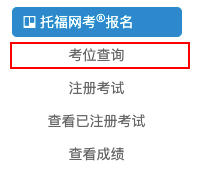
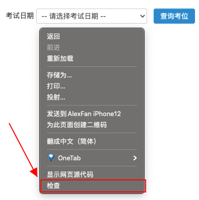
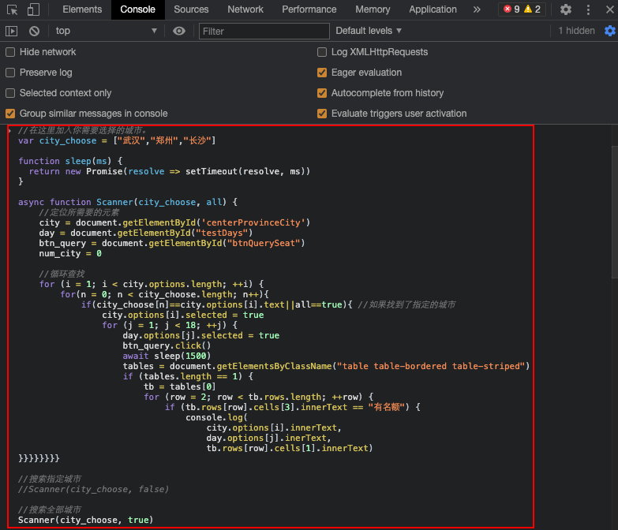
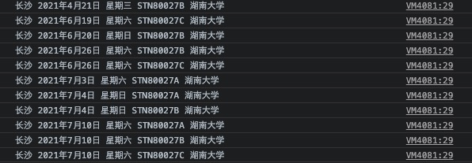

# Toefl-Scanner-Pro

TOEFL NEEA 托福空余考位自动扫描脚本，支持自定义城市、时间。


## 🤖️使用方法

- 登录NEEA TOEFL界面

- 点击「考位查询」



- 打开检查界面，点击Console界面



- 在Console栏中粘贴以下代码，空余考位将直接显示在Console栏


🚀**Scanner()默认搜索全部城市，如果需要搜索选定城市，请将最下方Scanner()中的【true】改为【false】**

🚀**可搜索全部城市，搜索选定城市，请将相应代码注释**

	自定义查询的时间范围 2021年4月10日至2021年10月30日（包含开始结束日）

	例如：var time_start_end = ["2021-4-10","2021-10-30"]

	若想查询所有考试时间，则将开始时间、结束时间设置为date.options范围以外即可，

	例如：var time_start_end = ["2000-4-10","2099-10-30"]

```javascript
//在这里加入你需要选择的城市。
var city_choose = ["武汉","长沙","南昌"]

//在这里加入你需要选择的时间[start_time,end_time]。
var time_start_end = ["2021-4-10","2021-10-30"]

//搜索全部时间
//var time_start_end = ["2000-4-10","2099-10-30"]

function sleep(ms) {
  return new Promise(resolve => setTimeout(resolve, ms))
}

async function Scanner(city_choose, all) {
    //定位所需要的元素
    city = document.getElementById('centerProvinceCity')
    day = document.getElementById("testDays")
    btn_query = document.getElementById("btnQuerySeat")
    num_city = 0

    //循环查找
    for (i = 1; i < city.options.length; ++i) {
        for(n = 0; n < city_choose.length; n++){
            if(city_choose[n]==city.options[i].text||all==true){ //如果找到了指定的城市
                city.options[i].selected = true
                for (j = 1; j < day.options.length; ++j) {
                    if(compare(day.options[j].text)){ //如果找到了指定范围内的时间
                        day.options[j].selected = true
                        btn_query.click()
                        await sleep(1000)
                        tables = document.getElementsByClassName("table table-bordered table-striped")
                        if (tables.length == 1) {
                            tb = tables[0]
                            for (row = 2; row < tb.rows.length; ++row) {
                                if (tb.rows[row].cells[3].innerText == "有名额") {
                                    console.log(
                                        city.options[i].innerText,
                                        day.options[j].innerText,
                                        tb.rows[row].cells[1].innerText)
}}}}}}}}}


function compare(date){
    
    var cur = new Date(date.slice(0,date.indexOf("日")).replace("年","-").replace("月","-"));
    var start = new Date(time_start_end[0]);
    var end = new Date(time_start_end[1])

    return cur.getTime() >= start.getTime() && cur.getTime() <= end.getTime()
}

//搜索指定城市
//Scanner(city_choose, false)

//搜索全部城市
Scanner(city_choose, true)
```

- 输出结果



## 🎉鸣谢

感谢[NEEA_TOEFL_AUTOMATOR](https://github.com/Augustpan/NEEA_TOEFL_AUTOMATOR)的启发，本项目在此基础上新增了城市、时间选择功能。

